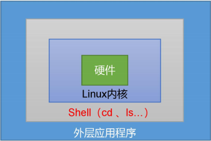

# Shell学习

[TOC]

## 1.Shell 概述

Shell是一个**命令行解释器**，它接收应用程序/用户命令，然后调用操作系统内核。还是一个功能相当强大的**编程语言**，易编写、易调试、灵活性强。

查看内置shell解析器，centOS默认使用的bash,通过软连接将sh指向bash

```shell
[root@chunis ~]# cat /etc/shells 
/bin/sh
/bin/bash
/usr/bin/sh
/usr/bin/bash
/bin/tcsh
/bin/csh
```

## 2.shell脚本入门

### 脚本格式

脚本以#!/bin/bash 开头（指定解析器），文件默认以sh为后缀。如 hello.sh

```shell
#!/bin/bash 
echo "helloworld"
```

### 脚本执行方式

1. 采用 bash 或 sh+脚本的相对路径或绝对路径（不用赋予脚本+x 权限）
  
    ```shell
    sh ./helloworld.sh # 相对路径
    sh /home/shells/helloworld.sh # 绝对路径
    bash ./helloworld.sh # 相对路径
    bash /home/shells/helloworld.sh # 绝对路径
    ```

2. 采用输入脚本的绝对路径或相对路径执行脚本（必须具有可执行权限+x）

    ```shell
    chmod +x helloworld.sh # 要赋予 helloworld.sh 脚本的执行权限
    ./helloworld.sh # 相对路径执行脚本
    /home/shells/helloworld.sh # 绝对路径执行脚本
    ```

3. 在脚本的路径前加上“.”或者 source

    ```shell
    . hello.sh
    source hello.sh
    ```

**注意**：第一种执行方法，本质是 bash 解析器帮你执行脚本，所以脚本本身不需要执行权限。第二种执行方法，本质是脚本需要自己执行，所以需要执行权限。前两种方式都是在当前shell中打开一个子shell来执行脚本内容,当脚本内容结束，则子shell关闭，回到父shell中。
第三种，也就是使用在脚本路径前加“.”或者 source 的方式，可以使脚本内容在当前 shell 里执行，而无需打开子 shell！这也是为什么我们每次要修改完/etc/profile 文件以后，需要source一下的原因。

**开子shell与不开子shell的区别**在于环境变量的继承关系，如在子shell中设置的 当前变量，父 shell 是不可见的

## 3.变量

### 系统常用变量

```shell
$HOME、$PWD、$SHELL、$USER等
```

### 查看变量

查看系统变量的值,如:```echo \$HOME```

显示当前 Shell 中的环境(全局)变量：```env```

打印当前 Shell 中的某个环境(全局)变量：```printenv HOME、echo $HOME```

显示当前 Shell 中所有变量：set

### 自定义变量

定义变量：变量名=变量值。**注意：**=号前后不能有空格

撤销变量：unset 变量名

声明只读(静态)变量：readonly 变量名=变量值,如：```readonly a=1```，注意：不能 unset

提升局部变量为全局变量：```export 变量名```,如：```export a```

变量默认类型都是字符串类型，无法直接进行数值运算,变量的值如果有空格，需要使用双引号或单引号括起来

### 特殊变量

+ ```$n```
功能描述：n 为数字，$0 代表该脚本名称，$1-$9 代表第一到第九个参数，十以 上的参数，十以上的参数需要用大括号包含，如${10}

+ ```$#```
功能描述：获取所有输入参数个数，常用于循环,判断参数的个数是否正确以及 加强脚本的健壮性

+ ```$*、$@```
功能描述：变量代表命令行中所有的参数，**```$*```把所有的参数看成一个整体，不过```$@```把每个参数区分对待**

+ ```$?```
功能描述：最后一次执行的命令的返回状态。如果这个变量的值为 0，证明上一 个命令正确执行；如果这个变量的值为非 0（具体是哪个数，由命令自己来决定），则证明 上一个命令执行不正确了

    **实例：**

    ```shell
        [root@chunis scripts]# cat var.sh
        #!/bin/bash
        echo '==========$n=========='
        echo $0
        echo $1
        echo $2
        echo '==========$#=========='
        echo $#
        echo '==========$*=========='
        echo $*
        echo '==========$@=========='
        echo $@
        [root@chunis scripts]# sh var.sh a b c d e f g
        ==========$n==========
        var.sh
        a
        b
        ==========$#==========
        7
        ==========$*==========
        a b c d e f g
        ==========$@==========
        a b c d e f g
        [root@chunis scripts]# echo $?
        0
    ```

## 4.运算符

## 5.条件判断

## 6.流程控制（重点）

## 7.read 读取控制台输入

## 8.函数

## 9.正则表达式入门

## 10.文本处理工具
